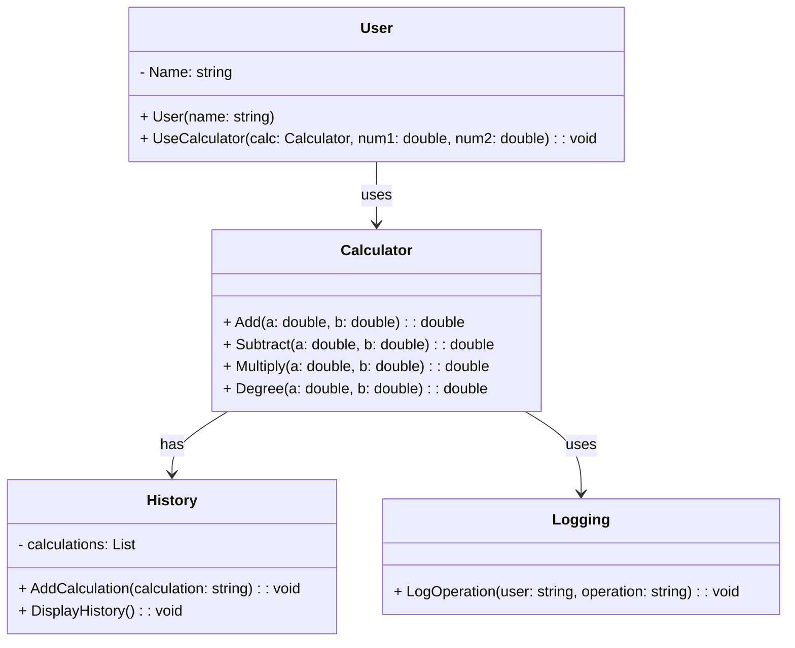

```mermaid
classDiagram
class Calculator {
+ Add(a: double, b: double): double
+ Subtract(a: double, b: double): double
+ Multiply(a: double, b: double): double
+ Degree(a: double, b: double): double
}

class User {
- Name: string
+ User(name: string)
+ UseCalculator(calc: Calculator, num1: double, num2: double): void
}

class History {
- calculations: List<string>
+ AddCalculation(calculation: string): void
+ DisplayHistory(): void
}

class Logging {
+ LogOperation(user: string, operation: string): void
}


User  -->  Calculator : uses
Calculator  -->  History : has
Calculator  -->  Logging : uses
```
